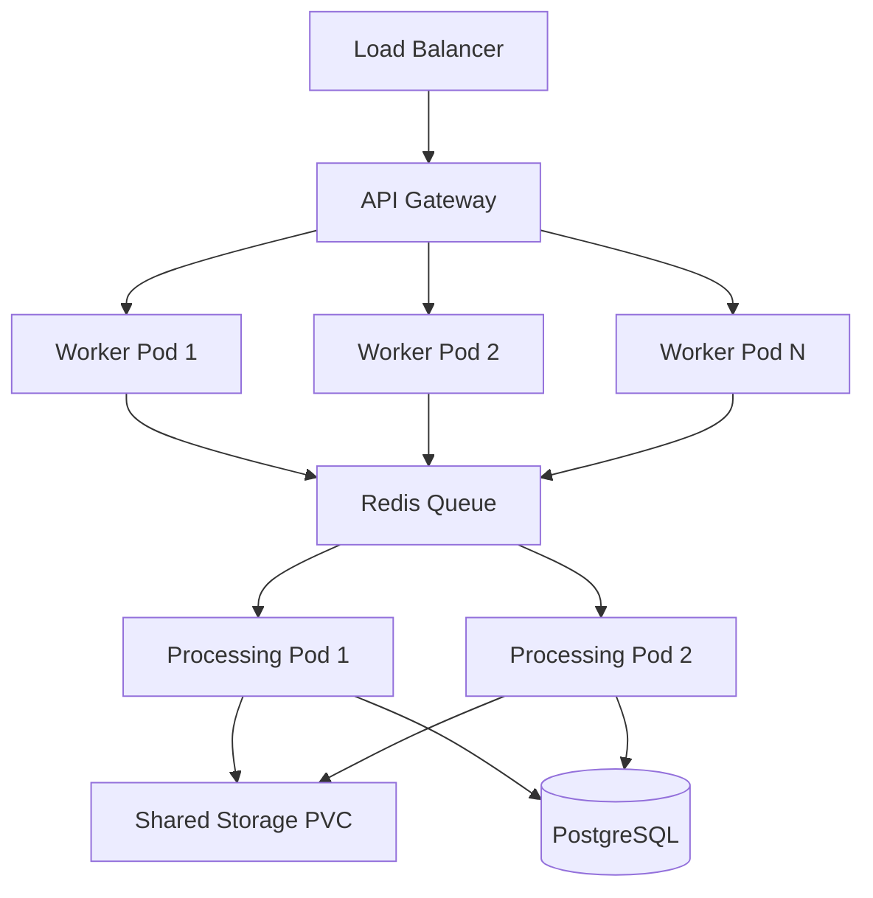

# 🔍 Enterprise Scaling & Security Analysis

## ⚠️ KRYTYCZNE PROBLEMY WSPÓŁBIEŻNOŚCI

### 1. **File Mixing w Wysokiej Współbieżności** 
❌ **PROBLEM**: Obecna implementacja używa prostych timestampów do nazw plików:
```javascript
const tempFile = `/tmp/pdf_security_${Date.now()}.pdf`;
const uniqueSuffix = `${Date.now()}-${Math.round(Math.random() * 1E9)}`;
```

**RYZYKO**: W środowisku setki/tysiące operacji na sekundę:
- Collision nazwp plików (Date.now() ma rozdzielczość ms)
- Race conditions podczas cleanup
- Mixing plików między requestami

### 2. **Temporary Files Management** 
❌ **PROBLEM**: Cleanup nie jest atomowy:
```javascript
// Cleanup może fail lub pozostawić zombie files
fs.unlinkSync(tempFile);
```

**RYZYKO**:
- Disk space leaks
- File handle exhaustion
- Security exposure (pozostałe pliki tymczasowe)

### 3. **Memory Management** 
❌ **PROBLEM**: Brak limitów pamięci dla concurrent operations:
```javascript
concurrentProcessing: 4 // Za mało dla enterprise load
```

**RYZYKO**:
- OOM kills w kontenerze
- Node.js heap overflow
- DoS przez duże pliki

## 🔒 DOCKER SECURITY GAPS

### 1. **Container Isolation**
❌ **PROBLEM**: Brak konfiguracji security contexts
- Brak user namespacing
- Root privileges w kontenerze
- Shared /tmp directory

### 2. **Persistent Storage**
❌ **PROBLEM**: Temp files w container filesystem
- Dane giną przy restart
- Brak backup procesów w trakcie
- Race conditions podczas rolling update

### 3. **Network Security**
❌ **PROBLEM**: Brak network policies
- Otwarte porty bez ograniczeń
- Brak TLS termination
- Możliwość SSRF attacks

## 📊 ENTERPRISE REQUIREMENTS vs CURRENT STATE

| Requirement | Current | Needed | Priority |
|-------------|---------|---------|----------|
| **Concurrent Users** | ~10-50 | 1000+ | 🔴 HIGH |
| **File Isolation** | Timestamp | UUID + PID | 🔴 HIGH |
| **Memory Management** | Basic | Advanced pooling | 🔴 HIGH |
| **Persistent Processing** | None | Queue system | 🔴 HIGH |
| **Security Context** | Root | Non-root user | 🔴 HIGH |
| **Storage Backend** | Local FS | S3/PVC | 🟡 MEDIUM |
| **Load Balancing** | None | Redis sessions | 🟡 MEDIUM |
| **Monitoring** | Basic | APM/Metrics | 🟡 MEDIUM |

## 🚀 ENTERPRISE SOLUTIONS

### 1. **Advanced File Isolation**
```javascript
// Better unique naming
const uniqueId = `${process.pid}-${Date.now()}-${crypto.randomUUID()}`;
const tempFile = `/app/temp/${uniqueId}.pdf`;
```

### 2. **Proper Resource Management**
```javascript
// Semaphore for concurrency control
const semaphore = new Semaphore(config.maxConcurrentOperations);
await semaphore.acquire();
// ... processing
semaphore.release();
```

### 3. **Docker Security Hardening**
```dockerfile
# Non-root user
USER node
# Read-only filesystem
--read-only --tmpfs /tmp
# Security profiles
--security-opt seccomp=secure.json
```

### 4. **Kubernetes Deployment**
```yaml
resources:
  limits:
    memory: "2Gi"
    cpu: "1000m"
  requests:
    memory: "1Gi" 
    cpu: "500m"
```

## ⚡ PERFORMANCE BOTTLENECKS

### Current Limitations:
1. **Single-threaded processing** mimo worker_threads availability
2. **Synchronous I/O** w niektórych operacjach
3. **No connection pooling** dla external services
4. **Linear scaling only** - brak queue systemów

### Impact przy 1000+ concurrent users:
- 🔴 **Memory**: 50MB+ per operation × 1000 = 50GB+
- 🔴 **CPU**: Blocking operations = degraded performance
- 🔴 **I/O**: File system saturation
- 🔴 **Network**: Connection exhaustion

## 🏗️ RECOMMENDED ARCHITECTURE



## 🛡️ SECURITY RECOMMENDATIONS

### 1. **Container Security**
- Security scanning (Trivy/Snyk)
- Distroless base images
- Resource quotas
- Network policies

### 2. **Data Protection**
- Encryption at rest
- TLS everywhere
- Secrets management (Vault)
- Audit logging

### 3. **Access Control**
- RBAC policies
- Service mesh (Istio)
- Rate limiting per user
- API key management

## 📈 SCALING STRATEGY

### Phase 1: Immediate Fixes (1-2 weeks)
1. Fix file naming collision
2. Implement proper cleanup
3. Add memory limits
4. Docker security hardening

### Phase 2: Architecture (2-4 weeks)  
1. Redis queue system
2. Kubernetes deployment
3. Horizontal pod autoscaling
4. Persistent volume claims

### Phase 3: Enterprise (4-8 weeks)
1. Service mesh
2. APM monitoring
3. Multi-region deployment
4. Disaster recovery

## 🎯 SUCCESS METRICS

| Metric | Current | Target |
|--------|---------|---------|
| Concurrent Users | 50 | 1000+ |
| Response Time | <2s | <500ms |
| Error Rate | <1% | <0.1% |
| Uptime | 99% | 99.9% |
| Security Score | 70/100 | 95/100 |

---

**⚠️ URGENT ACTION REQUIRED**: Obecna implementacja nie jest gotowa na enterprise load bez znaczących modyfikacji architektury i bezpieczeństwa. 